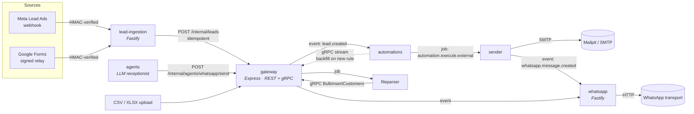

# LeadFlow

[](https://github.com/alexgrossidev/leadflow/actions/workflows/ci.yml)


**An event-driven backend that captures sales leads from ad platforms and follows them up automatically over email and WhatsApp, with an LLM receptionist on top.**

Seven TypeScript services and two shared packages that talk through typed BullMQ jobs, a typed event bus and gRPC streams, each owning its own MySQL database.

It is extracted from a CRM backend for small service businesses that I built as the lead engineer on a small team. For this public version I cut what didn't earn its place, closed the security and correctness gaps a production review found, and added the tests, local stand-ins and docs needed to run and judge it without any third-party accounts.

---

## What happens to a lead



1. **Capture.** `lead-ingestion` verifies the webhook signature on the raw bytes, runs an anti-spam gate (honeypot, replay window, content score, rate limit, dedupe), and enqueues a durable job. A resumable state machine fetches the lead from the Graph API, normalises field names across four languages, and delivers it to the gateway exactly once in effect, even though every step can fail and retry.
2. **Store and announce.** The gateway upserts the lead idempotently on `(business, source, external id)` and emits `lead.created`, with at-least-once delivery guaranteed by an `event_emitted_at` marker.
3. **Match.** `automations` evaluates the lead against each active rule. When a *new* rule is created, it backfills every existing matching lead over a server-streaming gRPC call with keyset pagination and backpressure.
4. **Pace and deliver.** `sender` runs each message through a step machine (clean and validate → daily limits and opening hours, DST-correct per business timezone → human-like pacing → deliver), then sends email over SMTP or hands WhatsApp messages to the `whatsapp` service, which manages per-tenant sessions on a third-party transport.

The **agents** service is an LLM receptionist: it answers inbound customer messages through tools, and turns free-text onboarding answers into structured records. Its replies go back through the same WhatsApp delivery path.

## Run it

Requires Docker and Node 22+.

```bash
cp .env.example .env
docker compose up --build        # MySQL, Redis, MinIO, Mailpit, stand-ins + the 7 services
npm install && npm run demo      # drives the whole path through the public APIs
```

`npm run demo` connects a WhatsApp session, logs in as the demo user, creates an automation ("welcome email, then a WhatsApp follow-up"), fires signed Google Forms and Meta webhooks (plus a duplicate and a spam submission that must be dropped), and prints what was delivered. Watch it arrive in the Mailpit inbox at <http://localhost:8025> and on the fake WhatsApp transport at <http://localhost:21465/__messages>.

No accounts or API keys are needed. Mailpit stands in for SMTP, a [contract-tested fake](services/whatsapp/dev/fake-transport.ts) for the WhatsApp transport, a [mock Graph API](services/lead-ingestion/scripts/mock-graph.ts) for Meta, MinIO for S3, and a deterministic fake for the LLM (set `LLM_PROVIDER=anthropic` and `ANTHROPIC_API_KEY` to use Claude).

> **Verification status.** Every service typechecks under `strict`, all 743 tests pass, and each production bundle boots against the exact environment `docker-compose.yml` gives it. All seven service images build in CI, but the full compose stack has not yet been run end to end. See [Known limitations](#known-limitations).

Without Docker, the tests need no infrastructure at all:

```bash
npm install
npm run check-types   # every workspace, strict TypeScript
npm test              # 743 tests: unit, property-based (fast-check), HTTP (supertest), contract
```

## Engineering highlights

Each links to the code. These are the parts I'd walk a reviewer through first.

**Reliability**
- **Exactly-once effect over at-least-once plumbing.** Lead delivery claims a row with a unique-key insert, reclaims stale claims with a conditional update, and treats "the POST succeeded but bookkeeping failed" as its own case, so a retry can never duplicate a lead. [`lead.delivery.ts`](services/lead-ingestion/src/dispatchers/lead/lead.delivery.ts), [`leadDelivery.repo.ts`](services/lead-ingestion/src/modules_inbound/fbLead/leadDelivery.repo.ts)
- **A message step machine with deterministic job ids.** Each stage returns a typed result that one function turns into the next job, a delayed rerun or a recorded error. A delivery ledger makes a replayed `DELIVER` a no-op, and limits are re-checked right before sending (a race a test found). [`sender.pipeline.ts`](services/sender/src/workers/sender.pipeline.ts), [`sender.DELIVER.ts`](services/sender/src/dispatchers/processor/sender.DELIVER.ts)
- **Idempotent intake with guaranteed event delivery.** A unique key, an `event_emitted_at` marker and a deterministic job id mean the caller's retry both dedupes the lead and re-sends a lost event. [`lead.service.ts`](services/gateway/src/modules/lead/lead.service.ts)
- **Pause, sweep and restore that can't interleave.** Every pause-lifecycle transaction locks the automation row first, and waiting happens in automations, so a pause reaches every step not yet handed off. [`pause.repo.ts`](services/automations/src/modules/automationTargets/pause.repo.ts)
- **Resumable bulk import.** Async-generator batching (backpressure from `for await`, not drain events), keyset pagination, and per-batch acknowledgement after the gRPC call succeeds. A 25k-row test proves it completes, and resumes after a mid-run failure without duplicates. [`delivery.ts`](services/fileparser/src/dispatchers/pipeline/delivery.ts)

**Security**
- **Refresh-token rotation with reuse detection.** Opaque tokens stored as digests and rotated by compare-and-set; replaying a rotated token revokes the whole family. An unknown user and a wrong password are indistinguishable, timing included. [`auth.service.ts`](services/gateway/src/modules/auth/auth.service.ts)
- **SSRF-safe fetching of untrusted URLs.** Every resolved address is checked (IPv4/IPv6, mapped and NAT64 forms), the socket is pinned to the checked address to defeat DNS rebinding, and every redirect hop is re-validated. [`safe-fetch.ts`](services/agents/src/core/net/safe-fetch.ts)
- **Signed, expiring, single-use OAuth state** against account-linking CSRF. [`oauth.state.ts`](services/lead-ingestion/src/modules_inbound/facebook/oauth.state.ts)
- **Secrets redacted where errors are born.** HTTP client errors lose their tokens at the axios boundary, and a shared log serializer strips the bound parameters Drizzle embeds in query errors, so no log line can carry customer data. [`serializers.ts`](packages/shared/src/logger/serializers.ts)
- **Injection-safe dynamic filters.** Custom-field slugs are bound as JSON-path parameters, never concatenated. [`lead.filter.ts`](services/gateway/src/protomodules/lead/lead.filter.ts)

**LLM engineering**
- **A vendor-neutral agent loop.** A single-shot `LlmProvider` port with Anthropic and Gemini adapters; the loop owns tool dispatch, schema validation, per-run caps and token and time budgets, so every vendor gets identical semantics. [`llm.port.ts`](services/agents/src/core/agent/llm.port.ts), [`loop.ts`](services/agents/src/core/agent/loop.ts)
- **Retries that never message a customer twice.** A run is retried only if the failure is transient *and* no side-effecting tool has succeeded yet. [`retry.ts`](services/agents/src/core/agent/retry.ts)
- **An offline eval harness.** 30 labelled onboarding scenarios (misspelled, mixed-language, prompt-injection, must-report-missing) scored by a weighted, unit-tested scorer. [`onboard-eval/`](services/agents/scripts/onboard-eval/)

**Type-level contracts**
- **Compile-time job and event contracts.** Job names map to payload types, so a producer and a consumer can't disagree without a type error, and type-level tests assert that wrong payloads don't compile. [`job.registry.ts`](packages/shared/src/jobs/job.registry.ts), [`typed-queue.ts`](packages/shared/src/jobs/typed-queue.ts), [`bullmq.eventBus.ts`](packages/shared/src/eventBus/bullmq.eventBus.ts)
- **One rule semantics in two places.** The gateway's SQL filter and automations' in-memory matcher follow the same documented semantics (case-insensitive, SQL NULL for missing values, numeric comparison only when both sides are numbers), so the gRPC backfill and the live path enrol the same leads. [`automation.rules.ts`](services/automations/src/modules/automations/automation.rules.ts), [`lead.filter.ts`](services/gateway/src/protomodules/lead/lead.filter.ts)

## Services

| Service | Role | Stack |
|---|---|---|
| [`gateway`](services/gateway) | Public REST API (auth, tenants, customers, leads, automations, uploads), internal intake, gRPC server | Express 5, Drizzle, gRPC |
| [`lead-ingestion`](services/lead-ingestion) | Meta and Google Forms webhooks, OAuth token lifecycle, reconciliation sync, dead-letter recovery | Fastify 5, BullMQ |
| [`automations`](services/automations) | Rule matching, enrolment, multi-step scheduling, pause and resume | BullMQ, gRPC client |
| [`sender`](services/sender) | Validation, limits, opening hours, human-like pacing, email (SMTP) and WhatsApp hand-off | BullMQ, nodemailer |
| [`whatsapp`](services/whatsapp) | Per-tenant sessions over a third-party transport, webhook translation, idempotent sends | Fastify 5, Redis locks |
| [`agents`](services/agents) | LLM receptionist and onboarding parser | Anthropic and Gemini SDKs |
| [`fileparser`](services/fileparser) | CSV/XLSX import: stage, dedupe, deliver in batches over gRPC | csv-parser, SheetJS, S3 |
| [`packages/shared`](packages/shared) | Typed queue client and job registry, typed event bus, Redis lock, storage, logging | BullMQ, redis |
| [`packages/rpc`](packages/rpc) | Protobuf contracts, generated clients, error mapping | buf, ts-proto, grpc-js |

**Cross-cutting:** Node 22 · TypeScript (strict) · MySQL 8 (database per service) · Redis · zod at every boundary · pino · vitest, fast-check and supertest · esbuild bundles · Turborepo · Docker · GitHub Actions (typecheck, tests, codegen drift, secret scan, image builds).

More detail: [architecture and message catalogue](docs/architecture.md) · [architecture decision records](docs/adr).

## Known limitations

Stated plainly rather than hidden:

- **Not yet run end to end in Docker.** The compose stack is assembled and every service boots against its compose environment, but the whole stack has not been brought up together yet.
- **At-least-once edges.** Email delivery (SMTP succeeded, ledger write failed) and bulk-import batches can repeat after a crash. Both are deduplicated downstream where possible and documented where not.
- **Single-worker assumptions.** Sender caps and pacing are strict with one `sender.process` worker; with several replicas they become soft limits. WhatsApp inactivity and reconnect timers are per process.
- **In-memory Excel parsing.** SheetJS can't stream `.xlsx`, so uploads are capped (20 MB by default). CSV is streamed.
- **No transactional outbox.** Automation and manual-lead events are emitted after commit and failures are logged. The intake path recovers through its caller; the others don't yet.
- **Plaintext gRPC** on the internal network. TLS or mTLS belongs at the mesh.

## What I'd do next

- A transactional outbox for every domain event, replacing post-commit emits.
- Move the agents' in-process work queue onto BullMQ so runs survive restarts.
- OpenTelemetry traces across HTTP, gRPC and queue hops (the correlation ids are already there).
- Contract tests between the gRPC client and server, and a Testcontainers suite that runs the demo path in CI.

## License

[MIT](LICENSE)
