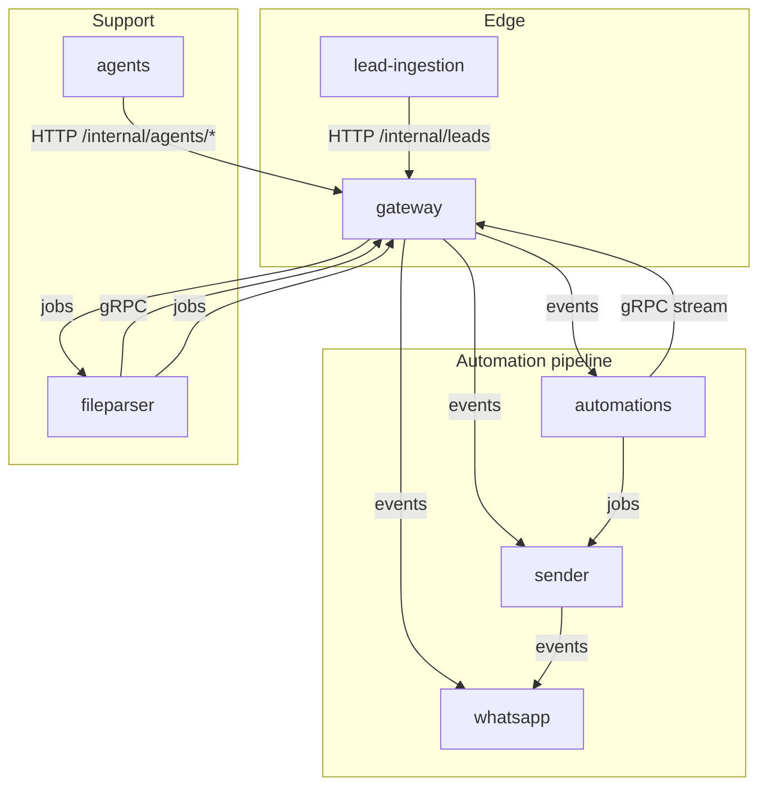
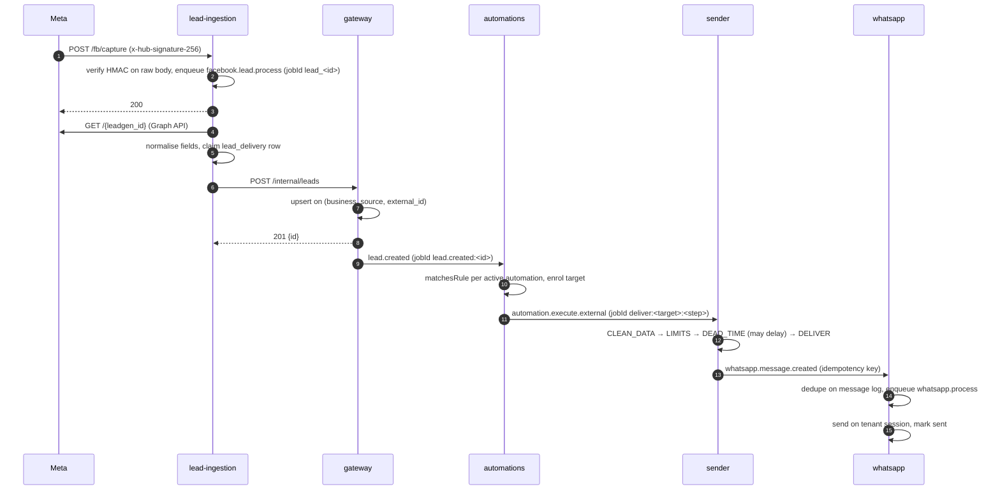

# Architecture

## Principles

- **A database per service.** No service reads another's tables; data crosses boundaries only as events, jobs, gRPC calls or internal HTTP. See [ADR 0002](adr/0002-database-per-service.md).
- **Asynchronous by default.** Work that can wait goes through BullMQ, so a slow or failing dependency delays work instead of losing it. gRPC is reserved for bulk data that must be streamed with backpressure. See [ADR 0001](adr/0001-bullmq-over-kafka.md) and [ADR 0003](adr/0003-grpc-for-bulk-data.md).
- **Contracts in the type system.** Every job and event name maps to one payload type in [`packages/shared`](../packages/shared), so producers and consumers can't drift apart silently.
- **Idempotency at every hop.** Every handler must tolerate redelivery: queues deliver at least once, and webhooks and HTTP callers retry. See [ADR 0004](adr/0004-idempotency-and-retries.md).
- **Validate at the boundary, trust inside.** zod parses every HTTP body, env file, job payload and third-party response where it enters a service.

## Services

Each service owns one MySQL database (`gateway`, `lead_ingestion`, `automations`, `sender`, `whatsapp`, `agents`, `fileparser`). All of them share Redis, for BullMQ and short-lived coordination such as locks, rate limits and dedupe keys.

## Transport

There are two kinds of queue traffic, both carried by BullMQ and both typed:

| | Job queue | Event bus |
|---|---|---|
| Addressed to | a **job name** (one queue per job) | a **consuming service** (one queue per service) |
| Used for | work a service schedules for itself or a known worker: retries, delays, step machines | facts other services react to: "a lead was created" |
| API | [`TypedQueueClient`](../packages/shared/src/jobs/typed-queue.ts): `enqueue`, `scheduleOnce`, `schedule`, `process` | [`BullMQEventBus`](../packages/shared/src/eventBus/bullmq.eventBus.ts): `emit`, `subscribe` |
| Contract | [`JobPayloadMap`](../packages/shared/src/jobs/job.registry.ts) | [`EventPayloadMap`](../packages/shared/src/eventBus/event.types.ts) |

Both sit behind the `QueueProvider` interface, which is the only place BullMQ is imported. Default retention keeps the last 1,000 completed and 5,000 failed jobs per queue for inspection. Payloads are never logged. Custom job ids are normalised in one place (`toJobId`), because BullMQ reserves `:`.

## Message catalogue

### Events

| Event | Producer | Consumer | Meaning |
|---|---|---|---|
| `lead.created` | gateway | automations | A lead was persisted (manual create, or intake from lead-ingestion). Carries the matchable fields. |
| `automation.created` / `updated` / `paused` / `deleted` | gateway | automations | Rule lifecycle. `created` triggers a gRPC backfill of existing matching leads. |
| `sender.autom_settings.created` / `updated` / `deleted` | gateway | sender | Per-business sending limits and opening hours changed. |
| `whatsapp.message.created` | sender, gateway (agent replies) | whatsapp | Deliver one WhatsApp message; carries an idempotency key. |
| `whatsapp.number.added` / `removed` | gateway | whatsapp | A tenant's WhatsApp number was connected or removed. |

### Jobs

| Job | Owner | Purpose |
|---|---|---|
| `facebook.lead.process` | lead-ingestion | Resumable fetch → parse → deliver of one Meta lead |
| `google.lead.process` | lead-ingestion | Normalise and deliver one Google Forms lead |
| `facebook.exchange.token` | lead-ingestion | OAuth code → long-lived page token state machine |
| `facebook.refresh.token` | lead-ingestion | Self-heal a failing token without destroying the working one |
| `facebook.check.subscription` | lead-ingestion | Daily per-account webhook subscription check (job scheduler) |
| `facebook.periodic.sync` | lead-ingestion | 10-minute reconciliation sweep with a high-water mark (job scheduler) |
| `facebook.token.revoked` | lead-ingestion → (unconsumed) | Tells the product to prompt the user to reconnect; no consumer in this repo yet |
| `automation.execute.internal` | automations | Per-target state machine: run the due step, schedule the next |
| `automation.execute.external` | automations → sender | Hand-off of one message to the sender |
| `automation.trigger.unpause` | automations | Paged restore of skipped targets after a resume |
| `cleanup` | automations | Batched pause sweeps and deletions, routed by `executionType` |
| `sender.process` | sender | The message step machine (`CLEAN_DATA` → `CALCULATE_LIMITS` → `CALCULATE_DEAD_TIME` → `DELIVER`) |
| `whatsapp.process` | whatsapp | Send one message on the tenant's session |
| `fileparser.bulk.import` | gateway → fileparser | Stage an uploaded file |
| `fileparser.import.settings` | fileparser | Deliver staged rows (self-rescheduling, bounded) |
| `fileparser.import.result` | fileparser → gateway | Report the outcome on the upload session |

### gRPC ([`packages/rpc/src/proto`](../packages/rpc/src/proto))

| RPC | Server | Client | Shape |
|---|---|---|---|
| `LeadService.GetLeadWithFilters` | gateway | automations | Server stream, keyset-paginated, backpressure-aware, with a deadline |
| `CustomerService.BulkInsertCustomers` | gateway | fileparser | Unary, one staged batch per call; retried only on `UNAVAILABLE` |

### Internal HTTP (`x-service-token`, compared in constant time)

| Endpoint | Caller | Purpose |
|---|---|---|
| `POST gateway/internal/leads` | lead-ingestion | Idempotent lead intake: `201` new, `200` duplicate |
| `POST gateway/internal/agents/whatsapp/send` | agents | An agent reply, bridged onto `whatsapp.message.created` |
| `POST/GET/DELETE whatsapp/sessions/:business/:user` | gateway / operator | Session lifecycle and QR |

## The lead-to-message sequence

## Failure handling at a glance

| Failure | Handling |
|---|---|
| Duplicate webhook, retried HTTP call, redelivered job | Deterministic job ids plus unique keys; the second attempt is a no-op |
| Transient dependency failure (DB connection, 5xx, 429, `UNAVAILABLE`) | Classified as retryable; exponential backoff with jitter |
| Permanent failure (validation, 4xx) | Not retried; recorded (`sending_errors`, `queue_recovery`, `facebook_token_failure`) |
| Retries exhausted | Dead-letter row with the original cause; lead-ingestion re-drives it with capped backoff |
| Lock holder overran its TTL | Compare-and-delete release refuses to delete someone else's lock and reports the overrun |
| Process shutdown | Ordered and awaited: HTTP → workers → queues → Redis → DB, with a hard timeout |
